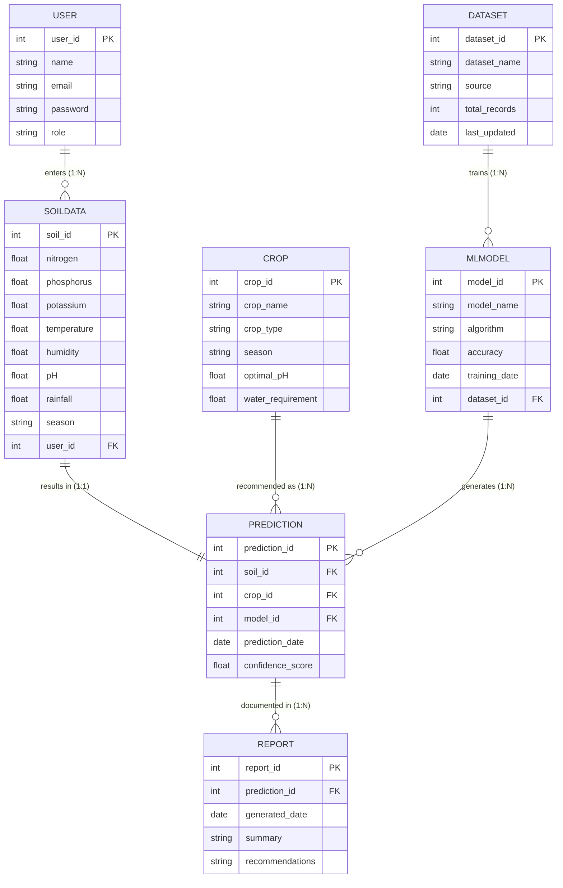

# Task 1: Entity Relationship Diagram (ERD)

## Project Title

**OptiCrop: Smart Agricultural Production Optimization Engine**

---

# Objective

To design an Entity Relationship Diagram (ERD) that represents the database structure of the OptiCrop: Smart Agricultural Production Optimization Engine. The ERD illustrates the relationships between users, soil data, crop information, datasets, machine learning models, predictions, and generated reports.

---

# Description

The Entity Relationship Diagram provides a blueprint for organizing and managing the application's data. It defines the entities, their attributes, primary keys, foreign keys, and relationships, ensuring data integrity and minimizing redundancy.

The ERD supports the complete machine learning workflow, from collecting soil information to generating crop recommendations and agricultural reports.

---

# Entity Relationship Diagram (ERD)

---

# Entity Attributes & Definitions

### 1. User
Stores registration and credentials details.
* **user_id (Primary Key):** Unique user identifier.
* **name:** User's full name.
* **email:** Unique email address (login credentials).
* **password:** Hashed security key.
* **role:** Account type (e.g. Farmer, Analyst, Admin).

### 2. SoilData
Stores chemical and environmental features entered by users.
* **soil_id (Primary Key):** Unique soil sample identifier.
* **nitrogen:** Nitrogen level (mg/kg).
* **phosphorus:** Phosphorus level (mg/kg).
* **potassium:** Potassium level (mg/kg).
* **temperature:** Atmospheric temperature (°C).
* **humidity:** Atmospheric humidity percentage (%).
* **pH:** Soil pH level scale.
* **rainfall:** Regional rainfall volume (mm).
* **season:** Harvest season (Kharif, Rabi, etc.).
* **user_id (Foreign Key):** Maps to `User.user_id`.

### 3. Crop
Stores database lookup features for potential crop classes.
* **crop_id (Primary Key):** Unique crop type identifier.
* **crop_name:** Crop label (e.g. Rice, Maize, Wheat).
* **crop_type:** Broad category (e.g. Cereal, Legume).
* **season:** Optimal planting season.
* **optimal_pH:** Favorable pH growth score range.
* **water_requirement:** Estimated water demand.

### 4. Dataset
Stores metadata about files used to fit classifiers.
* **dataset_id (Primary Key):** Unique dataset identifier.
* **dataset_name:** Filename or version code.
* **source:** Source publisher URL/organization.
* **total_records:** Total sample rows size count.
* **last_updated:** Last modified date timestamp.

### 5. MLModel
Stores metadata for deployed binary estimators.
* **model_id (Primary Key):** Unique model file identifier.
* **model_name:** Deployed filename identifier.
* **algorithm:** Class method (e.g. Random Forest, XGBoost).
* **accuracy:** Model validation accuracy test score.
* **training_date:** Date of fit export.
* **dataset_id (Foreign Key):** Maps to `Dataset.dataset_id`.

### 6. Prediction
Captures the output results of ML classifications.
* **prediction_id (Primary Key):** Unique inference event identifier.
* **soil_id (Foreign Key):** Maps to `SoilData.soil_id`.
* **crop_id (Foreign Key):** Maps to `Crop.crop_id`.
* **model_id (Foreign Key):** Maps to `MLModel.model_id`.
* **prediction_date:** Inference runtime timestamp.
* **confidence_score:** Probability score output (0 to 1).

### 7. Report
Stores final generated farming recommendations summary.
* **report_id (Primary Key):** Unique report document identifier.
* **prediction_id (Foreign Key):** Maps to `Prediction.prediction_id`.
* **generated_date:** Report publishing date.
* **summary:** Short summaries.
* **recommendations:** Dynamic farming instructions (fertilizers, watering, etc.).

---

# Primary and Foreign Keys Mapping

| Entity | Primary Key | Foreign Key | Reference Entity |
| :--- | :--- | :--- | :--- |
| **User** | `user_id` | *None* | - |
| **SoilData** | `soil_id` | `user_id` | `User.user_id` |
| **Crop** | `crop_id` | *None* | - |
| **Dataset** | `dataset_id` | *None* | - |
| **MLModel** | `model_id` | `dataset_id` | `Dataset.dataset_id` |
| **Prediction** | `prediction_id` | `soil_id`, `crop_id`, `model_id` | `SoilData.soil_id`, `Crop.crop_id`, `MLModel.model_id` |
| **Report** | `report_id` | `prediction_id` | `Prediction.prediction_id` |

---

# Database Normalization (3NF)

The database schema is normalized to the **Third Normal Form (3NF)**:
* **First Normal Form (1NF):** All attributes contain only atomic values; no repeating groups.
* **Second Normal Form (2NF):** Extinguishes partial key dependencies (all non-key columns depend entirely on primary keys).
* **Third Normal Form (3NF):** Extinguishes transitive dependencies (no non-key attribute depends on another non-key attribute).

### Benefits of 3NF Design:
* **Reduced Data Redundancy:** Saves storage capacity by isolating properties.
* **Improved Consistency:** Prevents update anomalies (editing a user doesn't affect soil measurements).
* **Better Scalability:** Simplifies adding new tables (e.g. fertilizer stocks) later.
* **Faster Querying:** Indexing primary/foreign keys accelerates relational joins.

---

# Use Cases Supported

* **User Registration:** Adding a new farmer record.
* **Soil Data Collection:** Recording input parameters linked to a user profile.
* **Crop Recommendation:** Matching soil traits against predicted output targets.
* **Machine Learning Model Management:** Swapping model weights versions.
* **Dataset Management:** Tracking training file updates.
* **Prediction History:** Archiving previous classification events.
* **Agricultural Report Generation:** Documenting recommended crop steps.
* **Sustainable Farming:** Preserving chemical inputs guidelines.

---

# Outcome

The Entity Relationship Diagram establishes a structured and scalable database design for the OptiCrop system. It enables efficient storage and retrieval of agricultural, machine learning, and prediction data while supporting future enhancements.
