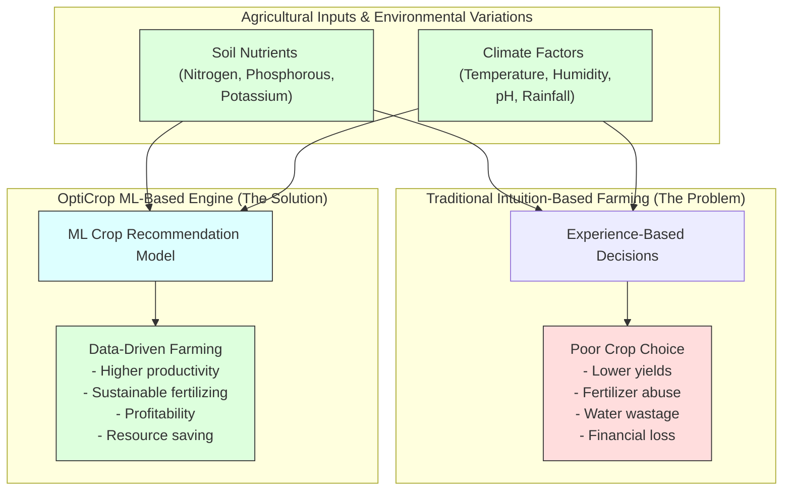

# Task 4: Specify the Business Problem

## Project Title

**OptiCrop: Smart Agricultural Production Optimization Engine**

---

# Objective

The objective of this phase is to identify and clearly define the agricultural problem that the OptiCrop Smart Agricultural Production Optimization Engine aims to solve. Understanding the business problem helps establish the project's scope, objectives, stakeholders, and expected outcomes before beginning data collection and model development.

---

# Introduction

Agriculture is one of the most important sectors contributing to food production and economic development. However, farmers often face difficulties in selecting the most suitable crop due to changing environmental conditions, lack of scientific guidance, and insufficient knowledge about soil health.

Traditional farming decisions are generally based on experience rather than data, which can lead to poor crop selection, lower productivity, excessive fertilizer usage, and financial losses.

OptiCrop addresses these challenges by using Machine Learning techniques to recommend the most suitable crop based on soil nutrients and environmental conditions.

---

# Business Problem Analysis Blueprint

---

# Business Problem Detail

Farmers frequently struggle with determining which crop should be cultivated under specific soil and climate conditions. Incorrect crop selection can result in:
* Reduced agricultural productivity
* Low crop yield
* Poor soil utilization
* Excessive fertilizer consumption
* Water wastage
* Increased farming costs
* Financial losses
* Environmental degradation

Since environmental factors vary from region to region, farmers require a data-driven decision support system capable of providing accurate crop recommendations.

---

# Problem Statement

Develop an intelligent Machine Learning-based crop recommendation system that analyzes soil nutrients and environmental conditions to recommend the most suitable crop for cultivation, improving productivity, profitability, and sustainable farming practices.

---

# Key Agricultural Parameters

The recommendation system considers the following parameters:
* **Nitrogen (N):** Primary leaf growth nutrient.
* **Phosphorous (P):** Root development and flower/fruit growth.
* **Potassium (K):** Overall plant health and disease resistance.
* **Temperature:** Favorable climate conditions.
* **Humidity:** Transpiration and crop moisture regulation.
* **Soil pH:** Favorable acidity/alkalinity for nutrient absorption.
* **Rainfall:** Water irrigation availability.
* **Seasonal Conditions:** Harvest schedules.

These parameters significantly influence crop growth and agricultural productivity.

---

# Stakeholders

The OptiCrop system serves multiple stakeholders:

### 1. Farmers
* Select suitable crops
* Increase productivity
* Reduce cultivation risks

### 2. Agricultural Researchers
* Analyze crop-environment relationships
* Improve farming methodologies

### 3. Agribusiness Organizations
* Support agricultural planning
* Optimize resource management

### 4. Government & Policymakers
* Promote sustainable agriculture
* Support evidence-based agricultural policies

---

# Proposed Solution

OptiCrop integrates Machine Learning algorithms with agricultural data to provide intelligent crop recommendations.

The system performs the following:
* Collects soil and environmental parameters
* Processes agricultural data
* Predicts the most suitable crop
* Provides fast and accurate recommendations
* Supports data-driven farming decisions

---

# Expected Benefits

* Improved crop productivity
* Better utilization of land and water resources
* Reduced farming risks
* Increased farmer profitability
* Sustainable agricultural practices
* Efficient fertilizer management
* Better decision-making using AI

---

# Scope of the Project

The project focuses on:
* Soil analysis
* Crop recommendation
* Environmental parameter analysis
* Machine Learning-based prediction
* Web-based application development
* Decision support for agriculture

---

# Outcome

The business problem has been successfully identified and analyzed. This phase establishes a clear understanding of agricultural challenges and provides the foundation for designing an AI-powered crop recommendation system capable of improving farming efficiency and sustainability.
