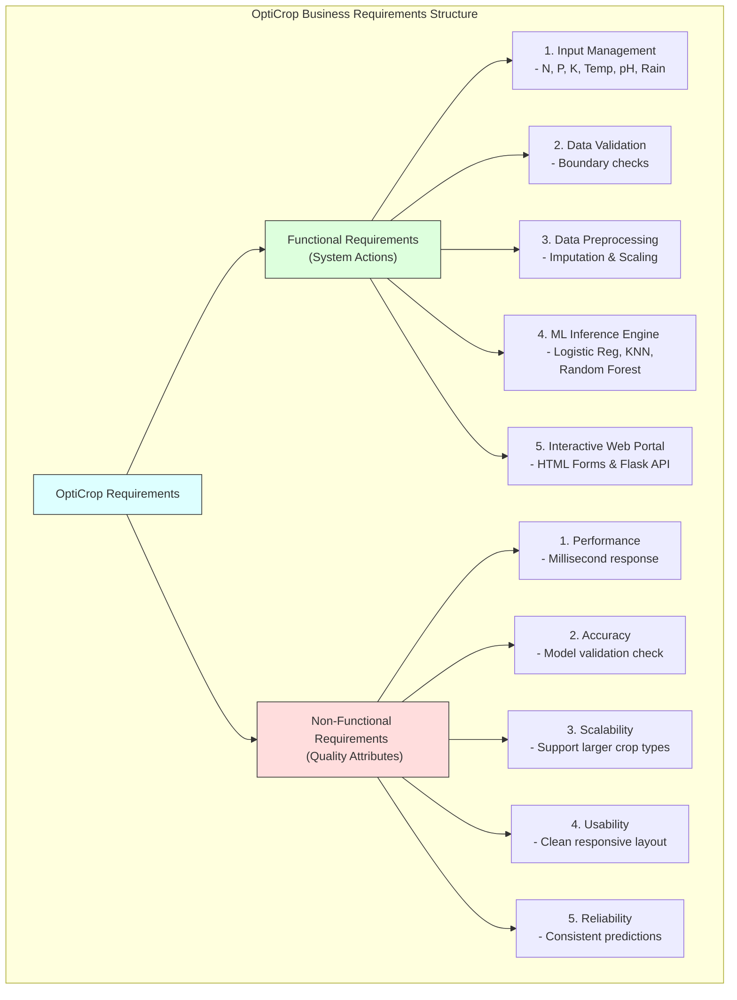

# Task 5: Business Requirements

## Project Title

**OptiCrop: Smart Agricultural Production Optimization Engine**

---

# Objective

The objective of this phase is to identify, analyze, and document the functional and non-functional requirements of the **OptiCrop: Smart Agricultural Production Optimization Engine**. These requirements define the expected behavior of the system and ensure that it effectively addresses the needs of farmers, agricultural researchers, agribusiness organizations, and policymakers.

---

# Introduction

Business requirements describe the capabilities that the OptiCrop system must provide to achieve its objectives. The platform should deliver accurate crop recommendations by analyzing soil nutrients and environmental conditions using Machine Learning techniques. Additionally, it should offer a simple, responsive, and user-friendly interface that enables users to easily interact with the application.

---

# Requirements Taxonomy Diagram

---

# Functional Requirements

## 1. User Input Management
The application shall allow users to enter agricultural parameters, including:
* Nitrogen (N)
* Phosphorous (P)
* Potassium (K)
* Temperature
* Humidity
* Soil pH
* Rainfall
* Seasonal information

## 2. Data Validation
The system shall validate all user inputs before processing to ensure data accuracy and prevent invalid values (e.g., negative nutrient values or pH scores out of the 0–14 boundary).

## 3. Data Preprocessing
The application shall preprocess the input data before prediction by:
* Handling missing values
* Scaling numerical features
* Formatting input data
* Preparing data for the Machine Learning model

## 4. Crop Prediction
The system shall analyze the processed agricultural data and predict the most suitable crop for cultivation using the trained Machine Learning model.

## 5. Machine Learning Support
The platform shall support multiple Machine Learning algorithms for model training and evaluation, including:
* K-Nearest Neighbors (KNN)
* Logistic Regression
* Decision Tree
* Random Forest
* K-Means Clustering
The best-performing model will be selected for deployment.

## 6. Prediction Results
The application shall display:
* Recommended crop
* Prediction confidence (if applicable)
* User-friendly output

## 7. Web Application
The system shall provide an interactive web interface developed using HTML, CSS, and Flask.
Users should be able to:
* Enter agricultural parameters
* Submit data
* Receive crop recommendations instantly

---

# Non-Functional Requirements

### 1. Performance
* Fast prediction response
* Efficient data processing
* Low execution time

### 2. Accuracy
The system should achieve high prediction accuracy by selecting the best-performing Machine Learning model.

### 3. Scalability
The application should support:
* Larger datasets
* Additional crop varieties
* New Machine Learning models
* Future cloud deployment

### 4. Reliability
The system should generate consistent crop recommendations under similar input conditions.

### 5. Usability
The application should provide:
* Simple interface
* Easy navigation
* Clear prediction results
* Responsive design

### 6. Maintainability
The source code should be modular, readable, and easy to update for future enhancements.

---

# Business Objectives

The OptiCrop platform aims to:
* Improve crop productivity
* Reduce farming risks
* Increase farmer profitability
* Promote sustainable agriculture
* Optimize water usage
* Improve fertilizer utilization
* Support precision farming
* Enable data-driven agricultural decision-making

---

# Expected Outcomes

Upon successful implementation, the system will:
* Recommend the most suitable crop based on soil and climate conditions.
* Help farmers maximize agricultural yield.
* Reduce crop failures caused by poor crop selection.
* Improve resource utilization.
* Support sustainable farming practices.
* Assist agricultural researchers in data analysis.
* Provide decision support for policymakers.

---

# Stakeholders

* Farmers
* Agricultural Researchers
* Agribusiness Organizations
* Government Agencies
* Agricultural Extension Officers
* Policymakers

---

# Technologies Used

* Python
* Flask
* HTML
* CSS
* NumPy
* Pandas
* Scikit-learn
* Matplotlib
* Seaborn

---

# Outcome

The business requirements for the OptiCrop Smart Agricultural Production Optimization Engine have been successfully identified and documented. These requirements provide a clear roadmap for developing an intelligent crop recommendation system that enhances agricultural productivity, supports sustainable farming practices, and delivers reliable, data-driven recommendations to end users.
