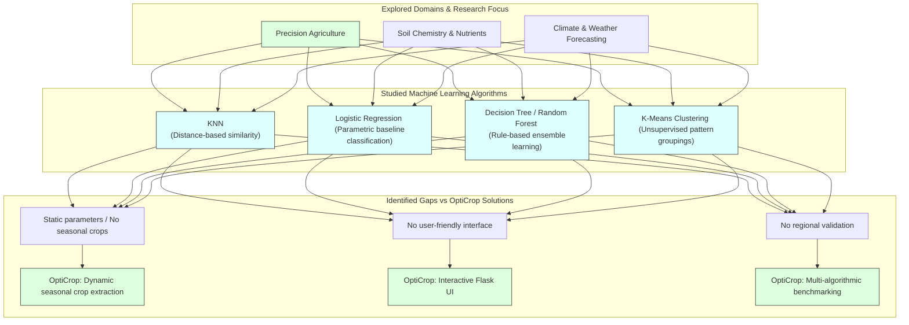

# Task 6: Literature Survey

## Project Title

**OptiCrop: Smart Agricultural Production Optimization Engine**

---

# Objective

The objective of this phase is to conduct a comprehensive study of existing research, technologies, and Machine Learning techniques used in agricultural crop recommendation systems. This survey helps identify suitable methodologies, understand current advancements, recognize research gaps, and select the most appropriate algorithms for developing the OptiCrop Smart Agricultural Production Optimization Engine.

---

# Introduction

Agriculture has evolved significantly with the adoption of Artificial Intelligence (AI), Machine Learning (ML), and Data Analytics. Modern crop recommendation systems utilize historical agricultural data, environmental parameters, and predictive models to recommend suitable crops for cultivation.

A literature survey provides valuable insights into existing research, helping developers understand successful approaches, identify limitations in current systems, and adopt best practices for building an efficient crop recommendation platform.

---

# Literature Survey Research Stack Diagram

---

# Existing Agricultural Recommendation Systems

Several intelligent agricultural systems have been developed to improve farming productivity through data-driven decision-making. These systems typically analyze:
* Soil nutrient composition
* Climate conditions
* Weather patterns
* Rainfall
* Temperature
* Humidity
* Soil pH
* Historical crop production

Their primary objective is to recommend crops that maximize agricultural productivity while minimizing resource wastage.

---

# Machine Learning Techniques Studied

The literature survey included an analysis of commonly used Machine Learning algorithms in agriculture.

## 1. K-Nearest Neighbors (KNN)
KNN predicts the most suitable crop by comparing the input conditions with similar historical agricultural records.
* **Advantages:**
  * Easy to implement
  * High prediction accuracy for smaller datasets
  * No training phase
* **Limitations:**
  * Slow prediction on large datasets
  * Sensitive to irrelevant features

## 2. Logistic Regression
Logistic Regression is a supervised classification algorithm used to classify agricultural conditions into suitable crop categories.
* **Advantages:**
  * Simple implementation
  * Fast prediction
  * Good performance on linearly separable data
* **Limitations:**
  * Limited capability for complex relationships

## 3. Decision Tree
Decision Trees create rule-based models for crop prediction.
* **Advantages:**
  * Easy interpretation
  * Handles categorical and numerical data
  * Simple visualization
* **Limitations:**
  * Can overfit the training dataset

## 4. Random Forest
Random Forest combines multiple Decision Trees to improve prediction accuracy.
* **Advantages:**
  * High accuracy
  * Reduces overfitting
  * Handles missing values effectively
* **Limitations:**
  * Higher computational cost

## 5. K-Means Clustering
K-Means groups similar soil and environmental conditions into clusters.
* **Advantages:**
  * Identifies hidden agricultural patterns
  * Useful for exploratory analysis
* **Limitations:**
  * Number of clusters must be predefined

---

# Data Preprocessing Techniques

Most research emphasizes preprocessing before model training. Common preprocessing techniques include:
* Handling missing values
* Removing duplicate records
* Outlier detection
- Feature scaling
- Feature engineering
- Data normalization

These techniques significantly improve model performance.

---

# Evaluation Metrics

Researchers commonly evaluate agricultural prediction models using:
* Accuracy
* Precision
* Recall
* F1-Score
* Confusion Matrix
* Cross Validation

These metrics help compare different algorithms and identify the best-performing model.

---

# Precision Agriculture

The survey also explored Precision Agriculture, where AI and IoT technologies are integrated to improve farming practices. Applications include:
* Smart irrigation
* Soil monitoring
* Weather forecasting
* Crop disease detection
* Yield prediction
* Fertilizer optimization

---

# Research Gaps Identified

Although many crop recommendation systems exist, several challenges remain:
* Limited regional datasets
* Lack of real-time weather integration
* Poor scalability
* Limited support for seasonal crop prediction
* Absence of user-friendly web applications
* Limited explainability of recommendations

These gaps motivated the development of the OptiCrop system.

---

# Proposed Improvements in OptiCrop

The OptiCrop project addresses these limitations by:
* Using multiple soil and climate parameters
* Comparing multiple Machine Learning algorithms
* Providing an intuitive web application
* Supporting intelligent crop recommendations
* Promoting sustainable farming practices
* Enabling future integration with IoT devices and cloud platforms

---

# Benefits of the Literature Survey

Conducting the literature survey helped to:
* Understand existing agricultural technologies
* Select suitable Machine Learning algorithms
* Identify effective preprocessing techniques
* Learn standard evaluation methods
* Recognize research opportunities
* Design a scalable crop recommendation system

---

# Conclusion

The literature survey provided a strong theoretical foundation for the OptiCrop project. By studying existing research, machine learning algorithms, and precision agriculture technologies, the project adopted proven methodologies while addressing current limitations. The insights gained during this phase guided the design of a reliable, accurate, and scalable AI-powered crop recommendation system that supports sustainable and data-driven farming practices.
