# Task 7: Social and Business Impact

## Project Title

**OptiCrop: Smart Agricultural Production Optimization Engine**

---

# Objective

The objective of this phase is to analyze the social and business impact of the OptiCrop Smart Agricultural Production Optimization Engine. This includes understanding how the system benefits farmers, agricultural organizations, researchers, policymakers, and society by promoting data-driven and sustainable farming practices.

---

# Introduction

Agriculture plays a vital role in ensuring food security and supporting the global economy. However, farmers often face challenges such as unpredictable weather, poor crop selection, inefficient resource utilization, and declining agricultural productivity.

The OptiCrop system leverages Artificial Intelligence and Machine Learning to recommend the most suitable crop based on soil nutrients and environmental conditions. By providing intelligent recommendations, the system supports better farming decisions, improves agricultural efficiency, and contributes to sustainable development.

---

# OptiCrop Impact Assessment Framework

```mermaid
graph TD
    OptiCrop([OptiCrop Smart Engine]) --> Social["Social Impact"]
    OptiCrop --> Business["Business Impact"]
    OptiCrop --> EcoEnv["Economic & Environmental Impact"]
    
    subgraph "Social Benefits"
        Social --> S1["Improved Farmer Decisions <br> (Scientific planning)"]
        Social --> S2["Increased Yield Productivity <br> (Optimal crop choice)"]
        Social --> S3["Reduced Crop Failure <br> (Risk mitigation)"]
        Social --> S4["Rural Development <br> (Higher rural income)"]
        Social --> S5["Food Security <br> (Optimized global supplies)"]
    end
    
    subgraph "Business & Research Benefits"
        Business --> B1["Agribusiness <br> (Supply chain forecasting)"]
        Business --> B2["Agricultural Research <br> (Environment studies)"]
        Business --> B3["Government Policies <br> (Resource planning)"]
        Business --> B4["Precision Agriculture <br> (Cost optimization)"]
    end
    
    subgraph "Eco-Economic Benefits"
        EcoEnv --> EE1["Fertilizer Optimization <br> (No excessive chemical use)"]
        EcoEnv --> EE2["Water Conservation <br> (Smart irrigation planning)"]
        EcoEnv --> EE3["Cost Reduction <br> (Optimized farming inputs)"]
        EcoEnv --> EE4["Soil Health preservation"]
    end
    
    style OptiCrop fill:#dfd,stroke:#333
    style Social fill:#ffd,stroke:#333
    style Business fill:#dff,stroke:#333
    style EcoEnv fill:#fdd,stroke:#333
```

---

# Social Impact

## 1. Improved Farmer Decision-Making
The system enables farmers to make informed crop selection decisions based on scientific analysis rather than assumptions or traditional practices.
* **Benefits:**
  * Better crop planning
  * Increased confidence in farming decisions
  * Reduced uncertainty

## 2. Increased Agricultural Productivity
Selecting the right crop according to soil and climate conditions improves overall farm productivity.
* **Benefits:**
  * Higher crop yield
  * Better land utilization
  * Improved production quality

## 3. Sustainable Farming Practices
OptiCrop encourages efficient utilization of natural resources. The system helps optimize:
* Water usage
* Fertilizer application
* Soil nutrients
* Land resources
This contributes to environmentally sustainable agriculture.

## 4. Reduced Crop Failure
Incorrect crop selection is one of the primary causes of agricultural loss. The recommendation engine minimizes this risk by suggesting crops that are suitable for the given environmental conditions.

## 5. Rural Development
Higher productivity and profitability improve the economic conditions of farming communities. Expected outcomes include:
* Increased farmer income
* Better employment opportunities
* Improved rural livelihoods

## 6. Food Security
Improved agricultural productivity contributes to increased food production, supporting national and global food security.

---

# Business Impact

## 1. Agribusiness Organizations
The system provides valuable agricultural insights that help organizations:
* Improve planning
* Optimize supply chains
* Forecast crop production
* Manage agricultural resources efficiently

## 2. Agricultural Researchers
Researchers can utilize prediction results and agricultural datasets to study:
* Crop-environment relationships
* Soil fertility patterns
* Climate impact on agriculture
* Machine Learning performance

## 3. Policymakers
Government agencies can use the generated insights for:
* Agricultural planning
* Resource allocation
* Sustainable farming policies
* Climate adaptation strategies

## 4. Precision Agriculture
OptiCrop supports precision farming by integrating Machine Learning into agricultural decision-making. This helps farmers maximize productivity while minimizing operational costs.

## 5. Technology Adoption
The project encourages the adoption of Artificial Intelligence in agriculture, accelerating digital transformation in the farming sector.

---

# Economic & Environmental Benefits

### Economic Benefits
* Increased crop productivity
* Reduced cultivation costs
* Improved resource efficiency
* Higher farmer profitability
* Lower agricultural risks

### Environmental Benefits
* Reducing excessive fertilizer usage
* Conserving water resources
* Maintaining soil fertility
* Minimizing environmental pollution
* Encouraging sustainable agricultural practices

---

# Future Scope

The platform can be extended with:
* IoT-based soil sensors
* Real-time weather integration
* Satellite imagery analysis
* Mobile application support
* Cloud deployment
* Fertilizer recommendation
* Crop disease prediction
* Smart irrigation systems

---

# Conclusion

The OptiCrop Smart Agricultural Production Optimization Engine has the potential to create a significant positive impact on agriculture and society. By combining Machine Learning with agricultural science, the system enables intelligent crop recommendations that improve productivity, reduce farming risks, and promote sustainable resource utilization. Beyond benefiting individual farmers, the project supports researchers, agribusiness organizations, and policymakers by providing valuable insights for strategic agricultural planning. Overall, crop recommendation contributes to the advancement of precision agriculture, rural development, food security, and the adoption of AI-driven farming solutions.
