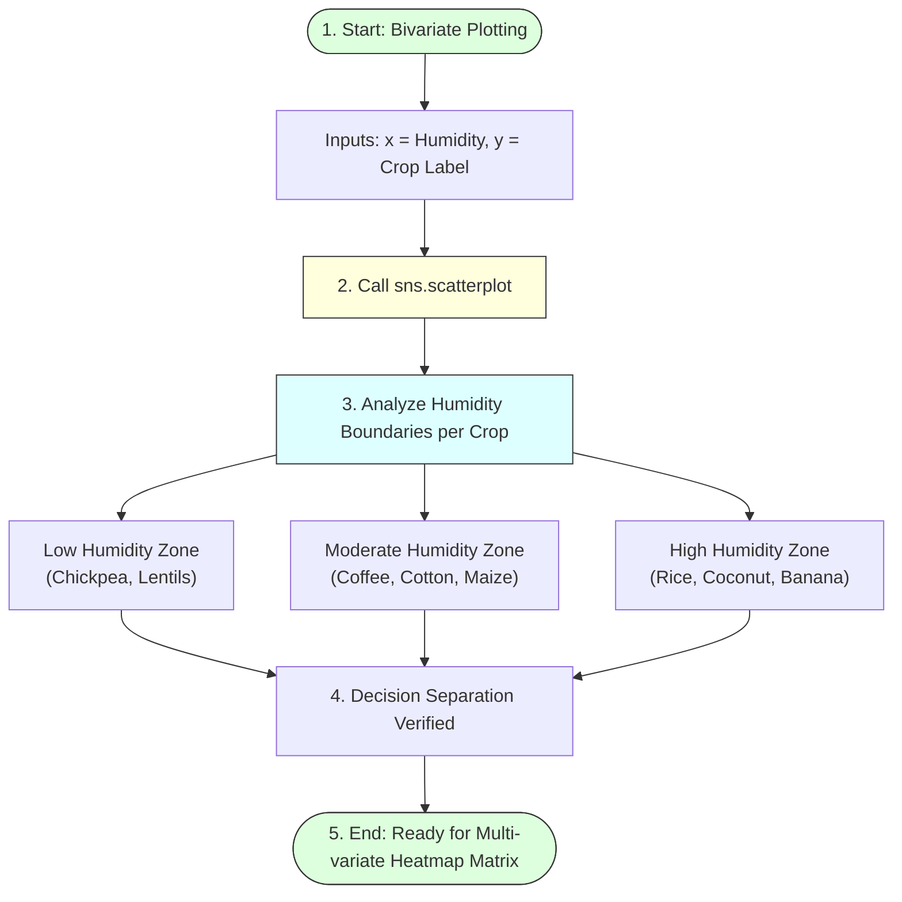

# Task 12: Bivariate Analysis

## Project Title

**OptiCrop: Smart Agricultural Production Optimization Engine**

---

# Objective

The objective of this task is to perform **Bivariate Analysis** on the agricultural dataset to understand the relationship between two variables. This analysis helps identify how individual environmental factors influence crop recommendations and provides valuable insights for building accurate Machine Learning models in the OptiCrop Smart Agricultural Production Optimization Engine.

---

# Introduction

Bivariate Analysis is an important phase of Exploratory Data Analysis (EDA) that examines the relationship between two variables. Unlike Univariate Analysis, which studies a single feature independently, Bivariate Analysis helps determine whether one variable has an impact on another.

In the OptiCrop project, the relationship between **humidity** and **crop labels** is analyzed using scatter plots. This visualization helps identify how different crops respond to varying humidity levels.

---

# Bivariate Analysis humidity vs Crop Mapping



---

# Features Used

* **Independent Variable:** Humidity
* **Dependent Variable (Target):** Crop Label

---

# Visualization Technique

The following visualization is used:
* **Scatter Plot:** Displays geographic coordinates of continuous points along categorical row lines.

Scatter plots provide a graphical representation of how humidity values vary across different crop categories.

---

# Python Libraries Used

```python
import matplotlib.pyplot as plt
import seaborn as sns
```

---

# Sample Code

```python
# Configure plot dimensions
plt.figure(figsize=(12, 10))

# Generate scatter plot mapping humidity to crop class
sns.scatterplot(
    x=data['humidity'],
    y=data['label'],
    hue=data['label'],  # Color markers by crop category
    legend=False        # Remove crowded legend since Y-axis lists names
)

# Label formatting
plt.title("Humidity Levels vs Crop Label Distribution")
plt.xlabel("Atmospheric Humidity (%)")
plt.ylabel("Crop Varieties")
plt.tight_layout()
plt.show()
```

---

# Analysis

The scatter plot illustrates how humidity influences crop suitability. Different crop types occupy different humidity ranges, indicating that humidity is an important environmental parameter for crop recommendation.

Some crops prefer:
* **Low humidity** (arid/semi-arid conditions)
* **Moderate humidity** (sub-tropical conditions)
* **High humidity** (humid tropical conditions)

This variation helps Machine Learning algorithms distinguish between crop classes.

---

# Observations & Crop Classification

### Rice
Rice is generally associated with high humidity conditions (typically above 80%).

### Coconut
Coconut grows well under relatively high humidity levels (typically above 80–90%).

### Coffee
Coffee crops are observed under moderate humidity conditions (typically 50–70%).

### Chickpea
Chickpea appears mostly in lower humidity environments (typically below 20%).

### Banana
Banana cultivation is concentrated in high humidity regions (typically 75–90%).

### Cotton
Cotton prefers moderate humidity levels (typically 60–80%).

---

# Importance of Bivariate Analysis

Bivariate Analysis helps to:
* Identify relationships between environmental factors and crops.
* Understand feature influence.
* Detect meaningful agricultural patterns.
* Improve feature selection.
* Support better Machine Learning predictions.

---

# Benefits

* Better understanding of agricultural data.
* Identification of crop-specific environmental requirements.
* Improved model accuracy.
* Supports intelligent crop recommendation.

---

# Conclusion

The Bivariate Analysis successfully demonstrated the relationship between humidity and crop labels. The scatter plot revealed that different crops require different humidity levels for optimal growth. These insights improve feature understanding and provide valuable information for building accurate crop recommendation models in the OptiCrop system.

---

# Outcome

The relationship between humidity and crop labels was successfully analyzed using a scatter plot. The analysis confirmed that humidity is an influential environmental factor in crop recommendation and provides useful information for developing robust Machine Learning models.
