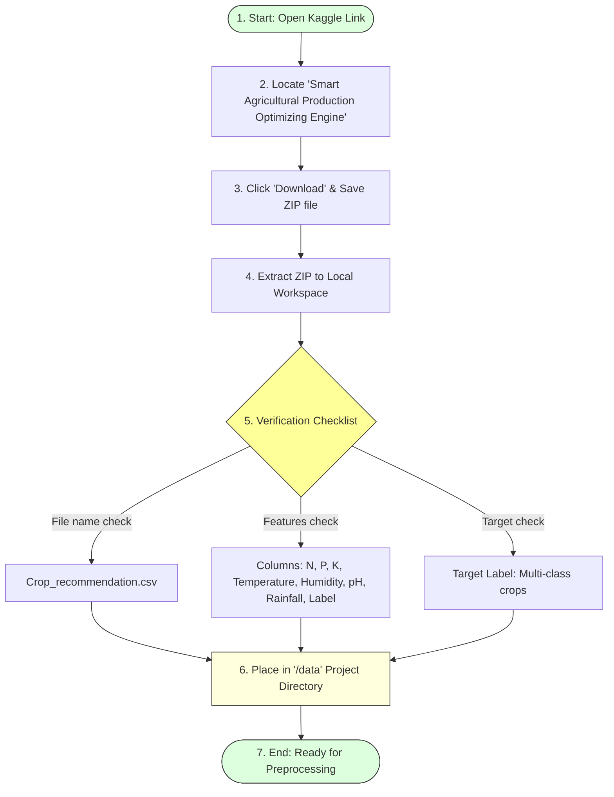

# Task 8: Download the Dataset

## Project Title

**OptiCrop: Smart Agricultural Production Optimization Engine**

---

# Objective

The objective of this task is to obtain a reliable agricultural dataset required for developing the **OptiCrop: Smart Agricultural Production Optimization Engine**. The dataset provides historical soil nutrient levels, environmental conditions, and crop information that serve as the foundation for data analysis, machine learning model training, and crop recommendation.

---

# Introduction

Machine Learning models require high-quality datasets to generate accurate predictions. For the OptiCrop project, the **Crop_recommendation.csv** dataset is collected from Kaggle. It contains agricultural and environmental parameters essential for recommending suitable crops under different farming conditions.

The dataset is widely used in agricultural machine learning projects because it includes balanced crop records and multiple environmental features that directly influence crop growth.

---

# Dataset Acquisition & Verification Workflow

---

# Dataset Source

* **Platform:** Kaggle
* **Dataset Name:** Smart Agricultural Production Optimizing Engine
* **Dataset File:** `Crop_recommendation.csv`
* **Dataset Link:** https://www.kaggle.com/datasets/chitrakumari25/smart-agricultural-production-optimizing-engine

---

# Dataset Description

The dataset contains soil nutrient information and environmental parameters collected from agricultural observations. The target variable is the crop label, which represents the most suitable crop for the given conditions.

---

# Dataset Features Specification

| Feature | Data Type | Description |
| :--- | :--- | :--- |
| **Nitrogen (N)** | Numeric | Nitrogen content ratio in soil (mg/kg) |
| **Phosphorous (P)** | Numeric | Phosphorous content ratio in soil (mg/kg) |
| **Potassium (K)** | Numeric | Potassium content ratio in soil (mg/kg) |
| **Temperature** | Continuous | Average environmental temperature (°C) |
| **Humidity** | Continuous | Relative atmospheric humidity percentage (%) |
| **pH** | Continuous | Soil pH value (acidic/alkaline scale 0–14) |
| **Rainfall** | Continuous | Average annual regional rainfall in millimeters (mm) |
| **Label** | Categorical | Recommended crop class target (e.g. Rice, Maize, etc.) |

---

# Purpose of the Dataset

The dataset is used for:
* Agricultural data analysis
* Crop recommendation
* Soil condition analysis
* Machine Learning model training
* Prediction evaluation
* Smart farming research

---

# Download Procedure

1. Open the Kaggle website.
2. Search for **Smart Agricultural Production Optimizing Engine**.
3. Open the dataset page.
4. Click the **Download** button.
5. Extract the downloaded ZIP file.
6. Copy the **Crop_recommendation.csv** file into the project directory (e.g. `data/Crop_recommendation.csv`).

---

# Benefits of Using the Dataset

* **Publicly available:** Free and open access for academic and commercial analysis.
* **Well-structured:** Pre-formatted row-column relational schema.
* **Clean agricultural data:** Pre-compiled records requiring minimal manual scrubbing.
* **Suitable for supervised learning:** Labeled classification outputs ready for standard algorithms.
* **Multiple environmental parameters:** Features are highly correlated with target crop growths.
* **Supports crop recommendation systems:** Serves as a standard benchmark for multi-class classifiers.

---

# Expected Outcome

The Crop_recommendation.csv dataset is successfully downloaded and stored in the project directory, making it ready for preprocessing, exploratory data analysis, and Machine Learning model development.

---

# Conclusion

The agricultural dataset was successfully obtained from Kaggle and prepared for use in the OptiCrop project. This dataset serves as the primary data source for training Machine Learning models, analyzing environmental conditions, and generating intelligent crop recommendations that support sustainable farming practices.
