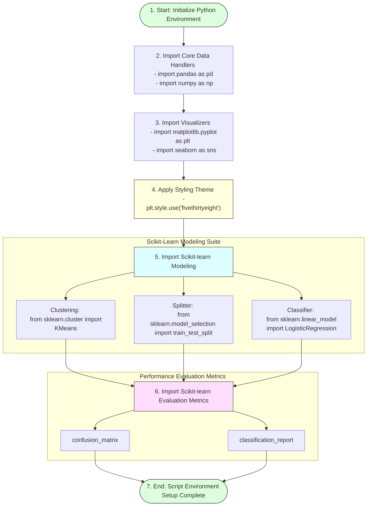

# Task 9: Importing the Libraries

## Project Title

**OptiCrop: Smart Agricultural Production Optimization Engine**

---

# Objective

The objective of this task is to import all the required Python libraries needed for data manipulation, visualization, machine learning, and model evaluation in the **OptiCrop: Smart Agricultural Production Optimization Engine**. These libraries provide the essential functionalities required to preprocess agricultural data, build machine learning models, evaluate prediction performance, and visualize analytical insights.

---

# Introduction

Python offers a rich ecosystem of libraries for data science and machine learning. In the OptiCrop project, multiple libraries are imported to simplify data processing, exploratory data analysis (EDA), visualization, clustering, classification, and model evaluation.

Using these libraries significantly reduces development time while improving the accuracy and efficiency of agricultural data analysis.

---

# Libraries Import & Setup Schema



---

# Libraries Imported

## 1. Pandas
```python
import pandas as pd
```
* **Purpose:** Handles structured dataframes.
* **Applications:**
  * Reading CSV files (`pd.read_csv`)
  * Data preprocessing and cleaning
  * Feature transformations

## 2. NumPy
```python
import numpy as np
```
* **Purpose:** Provides high-performance numerical computing support.
* **Applications:**
  * Multi-dimensional array operations
  * Statistical calculations

## 3. Matplotlib
```python
import matplotlib.pyplot as plt
```
* **Purpose:** Serves as the base engine for graphical plots.
* **Applications:**
  * Line, bar, scatter, and histogram creation

## 4. Seaborn
```python
import seaborn as sns
```
* **Purpose:** Generates advanced and aesthetically rich statistical visualizations.
* **Applications:**
  * Heatmaps, pair plots, box plots, and density plots

## 5. K-Means Clustering
```python
from sklearn.cluster import KMeans
```
* **Purpose:** Unsupervised grouping of similar agricultural conditions.
* **Applications:**
  * Discovering hidden soil parameter profile clusters

## 6. Train-Test Split
```python
from sklearn.model_selection import train_test_split
```
* **Purpose:** Partitions variables matrices into training and evaluation sets.
* **Applications:**
  * Model fitting verification and out-of-sample testing

## 7. Logistic Regression
```python
from sklearn.linear_model import LogisticRegression
```
* **Purpose:** Supervised multi-class classification solver.
* **Applications:**
  * Predicting the optimal crop based on soil conditions

## 8. Confusion Matrix
```python
from sklearn.metrics import confusion_matrix
```
* **Purpose:** Calculates true positives, false positives, true negatives, and false negatives.
* **Applications:**
  * Accuracy benchmarking and classification error analysis

## 9. Classification Report
```python
from sklearn.metrics import classification_report
```
* **Purpose:** Summarizes main precision and recall statistics.
* **Metrics Included:**
  * Precision, Recall, F1-Score, and Support

---

# Visualization Style

The project applies the **FiveThirtyEight** plotting theme to construct readable and professional visualizations:

```python
# Configure visualization styles
plt.style.use("fivethirtyeight")
```

### Benefits:
* **Better readability:** High-contrast grids improve visual inspection.
* **Professional appearance:** Clean layouts suitable for executive summaries.
* **Consistent formatting:** Automatic line widths, font choices, and colors.

---

# Imported Libraries Summary Table

| Package / Module | Import Statement | Core Purpose |
| :--- | :--- | :--- |
| **Pandas** | `import pandas as pd` | Loading and manipulating tabular CSV files |
| **NumPy** | `import numpy as np` | High-speed linear algebra and mathematical arrays |
| **Matplotlib** | `import matplotlib.pyplot as plt` | Creating and configuring custom plots and graphs |
| **Seaborn** | `import seaborn as sns` | Advanced heatmap matrices and joint distribution plots |
| **KMeans** | `from sklearn.cluster import KMeans` | Clustering soil nutrient records |
| **Splitter** | `from sklearn.model_selection import train_test_split` | Splitting datasets into 80% train and 20% test subsets |
| **Classifier** | `from sklearn.linear_model import LogisticRegression` | Model fitting and crop recommendation prediction |
| **Confusion Matrix**| `from sklearn.metrics import confusion_matrix` | Evaluating classification error ratios |
| **Metrics Report** | `from sklearn.metrics import classification_report`| Summarizing Precision, Recall, and F1 performance |

---

# Importance of Library Import

Importing the required libraries ensures that the development environment is prepared for:
* Dataset loading
* Data preprocessing
* Exploratory Data Analysis
* Machine Learning model development
* Visualization
* Model evaluation
* Crop prediction

---

# Outcome

All required Python libraries were successfully imported and configured. The environment is now ready for loading the agricultural dataset, performing exploratory data analysis, developing machine learning models, and evaluating prediction performance for the OptiCrop system.
