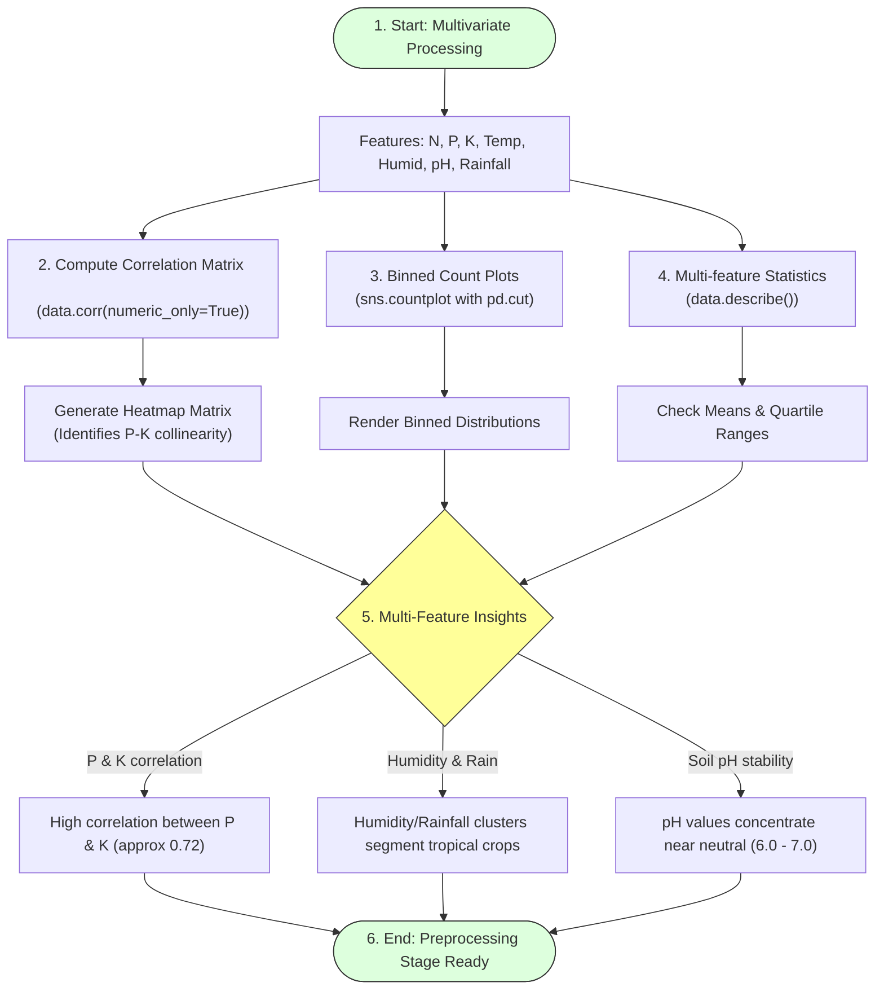

# Task 13: Multivariate Analysis

## Project Title

**OptiCrop: Smart Agricultural Production Optimization Engine**

---

# Objective

The objective of this task is to perform **Multivariate Analysis** on the agricultural dataset to study the relationships among multiple soil nutrients and environmental parameters simultaneously. This analysis helps identify hidden patterns, feature interactions, and correlations that influence crop recommendation in the OptiCrop Smart Agricultural Production Optimization Engine.

---

# Introduction

Multivariate Analysis is an advanced Exploratory Data Analysis (EDA) technique used to analyze more than two variables at the same time. Unlike Univariate and Bivariate Analysis, it provides a comprehensive understanding of how multiple agricultural parameters collectively affect crop prediction.

The OptiCrop project analyzes important features such as Nitrogen (N), Phosphorous (P), Potassium (K), Temperature, Humidity, Soil pH, and Rainfall to understand their combined influence on different crop categories.

---

# Multivariate Analysis & Correlation Mapping



---

# Agricultural Features Considered

The following parameters are included in the analysis:
* Nitrogen (N)
* Phosphorous (P)
* Potassium (K)
* Temperature
* Humidity
* Soil pH
* Rainfall
* Crop Label

---

# Visualization & Statistical Techniques

The following analytical techniques are used:
* **Count Plot (Binned):** Visualizes the relative density of continuous values segmented into ranges.
* **Correlation Analysis:** Computes Pearson correlation coefficients to identify feature interactions.
* **Descriptive Statistics:** Generates comprehensive summary matrix values.

---

# Python Libraries Used

```python
import matplotlib.pyplot as plt
import seaborn as sns
import pandas as pd
```

---

# Sample Codes

### 1. Binned Count Plots for Features
```python
plt.style.use("fivethirtyeight")
plt.figure(figsize=(18, 10))

features = ['N','P','K','temperature','humidity','ph','rainfall']

for i, feature in enumerate(features):
    plt.subplot(2, 4, i+1)
    # Bin continuous values into 10 intervals
    binned_feature = pd.cut(data[feature], bins=10)
    sns.countplot(x=binned_feature, palette="viridis")
    plt.title(f"Binned {feature}")
    plt.xticks(rotation=45)

plt.tight_layout()
plt.show()
```

### 2. Feature Correlation Heatmap
```python
plt.figure(figsize=(10, 8))
# Compute numerical feature correlations
correlation_matrix = data.corr(numeric_only=True)
sns.heatmap(correlation_matrix, annot=True, cmap="coolwarm", fmt=".2f")
plt.title("Agricultural Features Correlation Heatmap")
plt.show()
```

---

# Descriptive Analysis

Statistical analysis is performed using:

```python
# Display summary statistical matrix
data.describe()
```

The descriptive statistics include:
* **Count:** Number of entries (records size).
* **Mean:** Average parameter value.
* **Standard Deviation:** Variance dispersion score.
* **Minimum:** Absolute lowest sample boundary.
* **Maximum:** Absolute highest sample boundary.
* **Percentiles (25%, 50%, 75%):** Value distribution thresholds.

---

# Observations & Insights

### Nitrogen (N)
Nitrogen values are distributed across a wide range, indicating varying nutrient requirements for different crops.

### Phosphorous (P)
Phosphorous levels remain balanced for most agricultural samples with moderate variation, except for certain fruit crops showing high-level spikes.

### Potassium (K)
Potassium exhibits multiple concentration ranges depending on crop type. A strong correlation with Phosphorous is observed, indicating linked application requirements.

### Temperature
Temperature values remain within suitable agricultural cultivation limits.

### Humidity
Humidity shows considerable variation across crop categories, making it an important prediction feature for distinguishing between arid-loving and humid-loving crops.

### Soil pH
The pH values are concentrated around slightly acidic to neutral conditions, which are suitable for most crops.

### Rainfall
Rainfall demonstrates significant variation, reflecting diverse climatic conditions.

---

# Importance of Multivariate Analysis

Multivariate Analysis helps to:
* Study relationships among multiple agricultural parameters.
* Discover hidden data patterns.
* Support feature engineering.
* Improve Machine Learning model accuracy.
* Understand agricultural variability.

---

# Benefits

* Better understanding of feature interactions.
* Improved data quality assessment.
* Enhanced model development.
* Supports precision agriculture.
* Enables intelligent crop recommendation.

---

# Conclusion

Multivariate Analysis provided a comprehensive understanding of the relationships among soil nutrients and environmental parameters. The descriptive statistics and visualizations confirmed that the dataset contains diverse agricultural conditions suitable for Machine Learning-based crop recommendation. These insights contribute to better feature selection, model training, and prediction accuracy in the OptiCrop system.

---

# Outcome

The agricultural dataset was successfully analyzed using multivariate techniques and descriptive statistics. The analysis identified important feature interactions and confirmed that the dataset is well-suited for developing an intelligent crop recommendation model.
