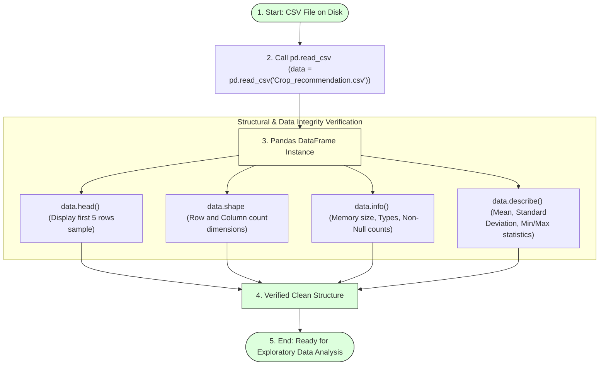

# Task 10: Read the Dataset

## Project Title

**OptiCrop: Smart Agricultural Production Optimization Engine**

---

# Objective

The objective of this task is to load the agricultural dataset into the Python environment using the Pandas library and verify that the data has been imported successfully. Reading the dataset correctly is an essential step before performing data preprocessing, exploratory data analysis (EDA), and machine learning model development in the OptiCrop Smart Agricultural Production Optimization Engine.

---

# Introduction

After downloading the agricultural dataset, it must be loaded into the Python environment for further processing. The Pandas library provides the `read_csv()` function, which efficiently reads CSV files and stores the data in a DataFrame.

Once the dataset is loaded, the first few records are displayed using the `head()` function. This helps understand the dataset structure, feature names, target variable, and overall data format before beginning analysis.

---

# Dataset Importation & Structural Validation Flow



---

# Dataset File

* **Dataset Name:** Crop_recommendation.csv
* **File Format:** CSV (Comma-Separated Values)

---

# Loading the Dataset

The dataset is loaded using the Pandas library.

```python
import pandas as pd

# Load the dataset into a DataFrame
data = pd.read_csv("Crop_recommendation.csv")
```

---

# Display First Five Records

The first five records are displayed to verify successful loading.

```python
# View sample head records
data.head()
```

---

# Sample Output DataFrame View

| N | P | K | temperature | humidity | ph | rainfall | label |
|---|---|---|-------------|----------|----|----------|-------|
| 90 | 42 | 43 | 20.87 | 82.00 | 6.50 | 202.93 | Rice |
| 85 | 58 | 41 | 21.77 | 80.31 | 7.03 | 226.65 | Rice |
| 60 | 55 | 44 | 23.00 | 82.32 | 7.84 | 263.96 | Rice |
| 74 | 35 | 40 | 26.49 | 80.15 | 6.98 | 242.86 | Rice |
| 78 | 42 | 42 | 20.13 | 81.60 | 7.62 | 262.71 | Rice |

---

# Dataset Features Specification

The dataset contains eight important columns:

| Feature | Unit | Description |
| :--- | :--- | :--- |
| **Nitrogen (N)** | mg/kg | Nitrogen content in soil |
| **Phosphorous (P)** | mg/kg | Phosphorous content in soil |
| **Potassium (K)** | mg/kg | Potassium content in soil |
| **Temperature** | °C | Environmental temperature |
| **Humidity** | % | Relative atmospheric humidity |
| **pH** | Scale | Soil pH value (0–14 acidity/alkalinity scale) |
| **Rainfall** | mm | Rainfall received |
| **Label** | Category | Recommended crop name |

---

# Importance of Reading the Dataset

Reading the dataset allows us to:
* Verify successful dataset import.
* Understand the dataset structure.
* Identify feature columns.
* Observe target labels.
* Detect formatting issues before preprocessing.
* Prepare data for exploratory analysis.

---

# Validation Checks Performed

After loading the dataset, the following checks are performed:

### 1. Display Dataset Shape
```python
# Check total records and columns count
print(data.shape)
```
* **Purpose:** Identifies rows (sample size) and columns count.

### 2. Display Column Names
```python
# View labels of features matrix
print(data.columns)
```
* **Purpose:** Verifies feature names and confirms the location of target column.

### 3. Display Data Types
```python
# Verify column schemas
print(data.dtypes)
```
* **Purpose:** Confirms continuous numbers are float/int types, and crop target is object type.

### 4. Dataset Information
```python
# Inspect non-null data distributions
data.info()
```
* **Purpose:** Inspects memory usage, missing count indicators, and data formats.

### 5. Statistical Summary
```python
# View statistics matrix
data.describe()
```
* **Purpose:** Computes minimum, maximum, mean, standard deviation, and interquartile boundary limits.

---

# Benefits

Reading and validating the dataset ensures:
* Accurate data import.
* Proper feature identification.
* Early detection of inconsistencies.
* Reliable foundation for machine learning.

---

# Outcome

The Crop_recommendation.csv dataset was successfully loaded into a Pandas DataFrame. The first five records, dataset structure, feature names, and statistical information were verified successfully, confirming that the dataset is ready for exploratory data analysis and preprocessing.
