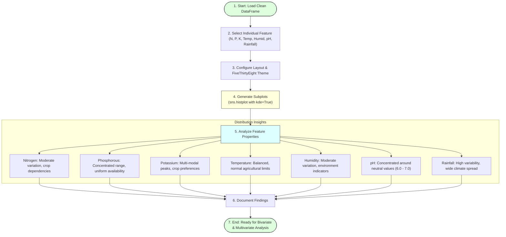

# Task 11: Univariate Analysis

## Project Title

**OptiCrop: Smart Agricultural Production Optimization Engine**

---

# Objective

The objective of this task is to perform **Univariate Analysis** on the agricultural dataset to understand the distribution, characteristics, and behavior of each individual feature. This analysis helps identify trends, value ranges, and potential anomalies in soil nutrients and environmental parameters before developing Machine Learning models for crop recommendation.

---

# Introduction

Univariate Analysis is one of the most important steps in Exploratory Data Analysis (EDA). It focuses on analyzing a single variable at a time without considering its relationship with other variables.

In the OptiCrop project, univariate analysis is performed on agricultural parameters such as Nitrogen (N), Phosphorous (P), Potassium (K), Temperature, Humidity, pH, and Rainfall. Understanding the distribution of these features provides valuable insights into the dataset and supports effective preprocessing and model development.

---

# Univariate Analysis Pipeline



---

# Agricultural Features Analyzed

The following features are analyzed individually:
* Nitrogen (N)
* Phosphorous (P)
* Potassium (K)
* Temperature
* Humidity
* Soil pH
* Rainfall

---

# Visualization Techniques

The following visualization methods are used:
* **Distribution Plot (Distplot / Histplot):** Visualizes the interval density.
* **Histogram:** Counts frequencies inside bins.
* **Kernel Density Estimation (KDE):** Approximates the probability density function curve.

These plots help visualize the frequency and distribution of each feature.

---

# Python Libraries Used

```python
import matplotlib.pyplot as plt
import seaborn as sns
```

---

# Sample Code

```python
# Set the plot style theme
plt.style.use("fivethirtyeight")

# Set up figure container
plt.figure(figsize=(18, 10))

# Specify the features to display
features = ['N', 'P', 'K', 'temperature', 'humidity', 'ph', 'rainfall']

# Loop through and generate subplots
for i, feature in enumerate(features):
    plt.subplot(2, 4, i + 1)
    sns.histplot(data[feature], kde=True, color='green')
    plt.title(f"Distribution of {feature}")
    plt.xlabel(feature)
    plt.ylabel("Density")

# Adjust spaces and show
plt.tight_layout()
plt.show()
```

---

# Feature-wise Analysis

## Nitrogen (N)
Nitrogen values vary across different agricultural conditions. The distribution shows moderate variation, indicating that crops require different nitrogen levels for optimal growth.

## Phosphorous (P)
Phosphorous values are concentrated within a specific range, suggesting balanced nutrient availability across most crop samples, with a smaller secondary peak for high-nutrient crops.

## Potassium (K)
Potassium values exhibit multiple peaks (multi-modal distribution), indicating that different crops require varying potassium concentrations, particularly fruit crops that demand high potassium.

## Temperature
Temperature values are distributed within standard agricultural growing conditions (typically 20°C to 30°C) and remain within a suitable cultivation range for most crops.

## Humidity
Humidity values show moderate variation with a left-skewed trend, reflecting different climatic environments suitable for crop cultivation, favoring tropical conditions.

## Soil pH
The pH distribution is concentrated near neutral values (6.0 to 7.0), indicating that most crops in the dataset prefer slightly acidic to neutral soil conditions for efficient nutrient uptake.

## Rainfall
Rainfall values display a wider spread with right-skewed distribution, representing diverse climatic conditions required for different crop varieties (e.g. Rice requires high rainfall, while cacti or millets require minimal rainfall).

---

# Observations

* Soil nutrient values vary significantly among different crop categories.
* Temperature remains within normal agricultural limits.
* Soil pH is relatively balanced.
* Rainfall exhibits greater variability than other features.
* No abnormal feature distributions were observed visually.

---

# Importance of Univariate Analysis

Univariate Analysis helps to:
* Understand individual feature distributions.
* Detect skewness in data.
* Identify unusual values (outliers).
* Support preprocessing decisions.
* Improve feature understanding before model training.

---

# Advantages

* Simple and effective data exploration.
* Helps detect anomalies.
* Improves data quality understanding.
* Supports better feature engineering.
* Facilitates machine learning model development.

---

# Outcome

Univariate analysis successfully examined each agricultural parameter individually. The visualizations provided valuable insights into soil nutrients and environmental conditions, confirming that the dataset is well-structured and suitable for further bivariate analysis, multivariate analysis, preprocessing, and machine learning model development.
