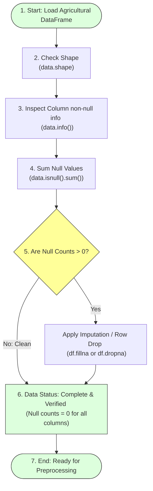

# Task 14: Checking for Null Values

## Project Title

**OptiCrop: Smart Agricultural Production Optimization Engine**

---

# Objective

The objective of this task is to examine the agricultural dataset for missing or null values before performing data preprocessing and machine learning operations. Detecting null values ensures that the dataset is complete, reliable, and suitable for accurate crop recommendation and predictive modeling.

---

# Introduction

Data quality is one of the most important factors affecting the performance of machine learning models. Missing values can lead to incorrect predictions, reduced model accuracy, and unreliable analytical results.

In the OptiCrop project, the dataset is thoroughly inspected using Pandas functions such as `shape`, `info()`, and `isnull().sum()` to verify that all agricultural parameters are complete before proceeding to feature engineering and model development.

---

# Null Values Checking and Data Validation Flow



---

# Dataset Inspection

The following functions are used to inspect the dataset:

### 1. Dataset Shape
```python
# Check total records and columns count
print(data.shape)
```
* **Purpose:** Displays the total number of rows and columns.
* **Example Output:** `(2200, 8)`
This indicates:
  * 2200 records
  * 8 columns

---

### 2. Dataset Information
```python
# Verify structural schemas and types
data.info()
```
* **Purpose:**
  * Displays column names.
  * Shows data types.
  * Verifies non-null values.
  * Displays memory usage.
* **Example Output:**
  ```
  <class 'pandas.core.frame.DataFrame'>
  RangeIndex: 2200 entries
  Data columns (total 8 columns):
   #   Column       Non-Null Count  Dtype  
  ---  ------       --------------  -----  
   0   N            2200 non-null   int64  
   1   P            2200 non-null   int64  
   2   K            2200 non-null   int64  
   3   temperature  2200 non-null   float64
   4   humidity     2200 non-null   float64
   5   ph           2200 non-null   float64
   6   rainfall     2200 non-null   float64
   7   label        2200 non-null   object 
  dtypes: float64(4), int64(3), object(1)
  memory usage: 137.6+ KB
  ```
* **Observation:** Every column contains complete records without missing values.

---

### 3. Checking Null Values
```python
# Count missing values per column
print(data.isnull().sum())
```
* **Purpose:** Counts the number of missing values in each column.
* **Example Output:**
  ```
  N              0
  P              0
  K              0
  temperature    0
  humidity       0
  ph             0
  rainfall       0
  label          0
  dtype: int64
  ```

---

# Observations

* No missing values were found.
* Every feature contains complete records.
* Dataset quality is excellent.
* No imputation techniques are required.

---

# Importance of Null Checks

Checking for null values helps to:
* Ensure data completeness.
* Improve prediction accuracy.
* Prevent model training errors.
* Simplify preprocessing.
* Enhance data reliability.

---

# Benefits

* High-quality dataset.
* Reduced preprocessing effort.
* Reliable statistical analysis.
* Improved machine learning performance.

---

# Conclusion

The agricultural dataset was successfully examined for missing values. The inspection confirmed that all columns contain complete records, making the dataset suitable for preprocessing, feature engineering, and machine learning model development without requiring any missing value treatment.

---

# Outcome

The dataset contains **2200 records** and **8 attributes**, with **zero missing values** across all features. Therefore, it is ready for the next preprocessing step.
