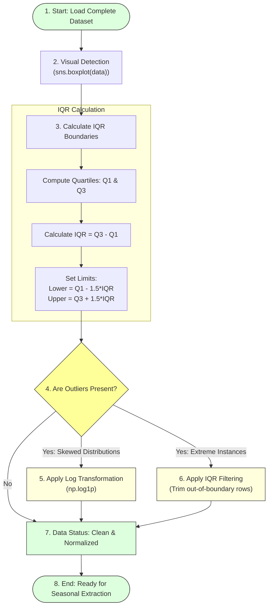

# Task 15: Handling Outliers

## Project Title

**OptiCrop: Smart Agricultural Production Optimization Engine**

---

# Objective

The objective of this task is to identify and handle outliers present in the agricultural dataset before training Machine Learning models. Outliers can significantly affect model performance by introducing extreme values that distort statistical analysis and prediction accuracy. In this project, boxplots and the Interquartile Range (IQR) method are used to detect outliers, followed by log transformation to normalize affected features.

---

# Introduction

Outliers are observations that differ significantly from the majority of data points. They may occur due to measurement errors, natural variability, or exceptional environmental conditions.

In agricultural datasets, extreme values in soil nutrients or climatic parameters can negatively influence Machine Learning algorithms by skewing the data distribution. Therefore, identifying and treating outliers is an essential preprocessing step.

---

# Outlier Processing Workflow



---

# Outlier Detection Methods

The OptiCrop project uses two approaches to identify outliers:
* **Boxplot Visualization:** Graphically represents distributions to isolate values lying outside standard ranges.
* **Interquartile Range (IQR) Method:** A statistical technique for detecting boundary deviations.

These methods help locate unusually high or low values while preserving meaningful agricultural information.

---

# Visualizing Outliers

A boxplot is used to identify outliers in all numerical features.

```python
import matplotlib.pyplot as plt
import seaborn as sns

plt.figure(figsize=(12, 6))
# Create boxplots for all features
sns.boxplot(data=data.drop('label', axis=1))
plt.title("Boxplot Distribution of Soil and Climate Features")
plt.show()
```

The boxplot provides a graphical representation of:
* Minimum value
* First Quartile (Q1)
* Median (Q2 / 50th Percentile)
* Third Quartile (Q3)
* Maximum value
* Potential outliers (values beyond whiskers)

---

# Interquartile Range (IQR) Calculation

The Interquartile Range (IQR) measures the spread of the middle 50% of data:

\[\text{IQR} = Q3 - Q1\]

To calculate outlier boundaries:

* **Lower Bound:** \(Q1 - 1.5 \times \text{IQR}\)
* **Upper Bound:** \(Q3 + 1.5 \times \text{IQR}\)

Any value falling outside these boundary limits is mathematically flagged as an outlier.

### Python Filtering Example:
```python
# Select target column (e.g. Phosphorous)
Q1 = data['P'].quantile(0.25)
Q3 = data['P'].quantile(0.75)
IQR = Q3 - Q1

# Filter records within safe boundaries
filter_condition = (
    (data['P'] >= Q1 - 1.5 * IQR) &
    (data['P'] <= Q3 + 1.5 * IQR)
)

data = data.loc[filter_condition]
print("Dataset size after outlier trimming:", data.shape)
```

---

# Log Transformation Treatment

For features with highly skewed distributions (e.g. Potassium or Rainfall), log transformation is applied to normalize data distributions and stabilize variance:

\[x_{\text{transformed}} = \ln(x + 1)\]

Using \(\ln(x + 1)\) via `np.log1p` prevents numerical errors if any values are exactly zero.

### Python Transformation Example:
```python
import numpy as np

# Apply log transformation to smooth the scale of Potassium (K)
data['K'] = np.log1p(data['K'])
print("Potassium transformation successfully applied.")
```

---

# Observations

The boxplot analysis indicates that:
* **Nitrogen (N):** Well-distributed with no major outliers.
* **Temperature:** Contains very few extreme observations.
* **Humidity:** Values remain within expected agricultural thresholds.
* **Rainfall:** Exhibits some high-value outliers (representing heavy monsoon crops like Rice).
* **Potassium (K):** Shows noticeable outliers and benefits from log transformation to normalize its scale.

After log transformation, the distribution becomes more balanced and suitable for Machine Learning.

---

# Importance of Handling Outliers

Handling outliers helps to:
* Improve prediction accuracy.
* Reduce data skewness.
* Enhance model stability.
* Prevent overfitting.
* Improve statistical analysis.

---

# Advantages

* Better quality dataset.
* More reliable predictions.
* Improved model generalization.
* Stable training process.
* Enhanced feature distribution.

---

# Conclusion

Outliers were successfully identified using boxplots and the Interquartile Range (IQR) method. Appropriate preprocessing techniques, including log transformation, were applied to reduce the influence of extreme values. The processed dataset is now more balanced and better suited for Machine Learning model development.

---

# Outcome

The agricultural dataset was successfully analyzed for outliers. Extreme values were identified using visualization and statistical methods, and normalization techniques were applied where required. The cleaned dataset is now ready for feature engineering and model training.
