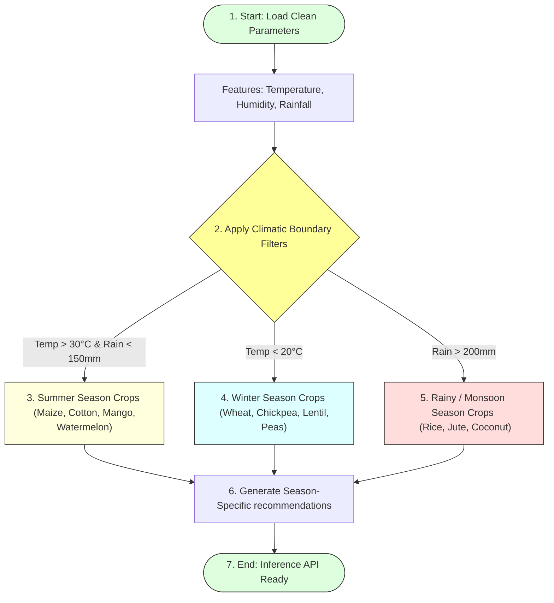

# Task 16: Extracting Seasonal Crops

## Project Title

**OptiCrop: Smart Agricultural Production Optimization Engine**

---

# Objective

The objective of this task is to classify and analyze crops based on seasonal environmental conditions such as temperature, humidity, and rainfall. Seasonal crop extraction helps identify suitable crops for different farming seasons, enabling more accurate crop recommendations and supporting sustainable agricultural planning in the OptiCrop Smart Agricultural Production Optimization Engine.

---

# Introduction

Agricultural production is highly influenced by seasonal changes. Different crops require specific environmental conditions to achieve optimum growth and productivity. By analyzing seasonal parameters, the OptiCrop system can identify which crops are most suitable for cultivation during summer, winter, or rainy seasons.

This process improves the accuracy of machine learning predictions and provides farmers with season-specific recommendations that maximize crop yield and resource utilization.

---

# Seasonal Crop Classification Decision Trees



---

# Seasonal Parameters Considered

The following environmental parameters are used to determine seasonal crop suitability:
* Temperature
* Humidity
* Rainfall

These features are analyzed together to classify crops into different agricultural seasons.

---

# Seasonal Categories

The agricultural dataset is grouped into three major seasons:

## 1. Summer Season
* **Characteristics:**
  * High Temperature
  * Moderate Humidity
  * Low to Moderate Rainfall
* **Example Crops:**
  * Maize, Cotton, Mango, Watermelon, Muskmelon

---

## 2. Winter Season
* **Characteristics:**
  * Low Temperature
  * Moderate Humidity
  * Low Rainfall
* **Example Crops:**
  * Wheat, Chickpea, Lentil, Peas, Barley

---

## 3. Rainy (Monsoon) Season
* **Characteristics:**
  * High Humidity
  * Heavy Rainfall
  * Moderate Temperature
* **Example Crops:**
  * Rice, Jute, Coconut, Papaya

---

# Implementation in Python

Seasonal crops are extracted by analyzing environmental attributes and grouping crops based on similar climatic conditions.

### Python Code:
```python
# Extract Summer Crops
summer_crops = data[
    (data["temperature"] > 30) &
    (data["rainfall"] < 150)
]["label"].unique()

# Extract Winter Crops
winter_crops = data[
    (data["temperature"] < 20)
]["label"].unique()

# Extract Rainy Crops
rainy_crops = data[
    (data["rainfall"] > 200)
]["label"].unique()

print("Summer Crops:", summer_crops)
print("Winter Crops:", winter_crops)
print("Rainy Crops:", rainy_crops)
```

The filtered datasets can then be used for seasonal analysis and recommendation.

---

# Importance of Seasonal Crop Extraction

Season-based crop analysis helps to:
* Recommend crops according to climatic conditions.
* Improve prediction accuracy.
* Reduce crop failure.
* Support precision agriculture.
* Enhance agricultural productivity.

---

# Advantages

* Better farming decisions.
* Efficient resource utilization.
* Increased crop yield.
* Reduced environmental risks.
* Supports sustainable agriculture.

---

# Applications

The extracted seasonal information can be used for:
* Crop recommendation systems
* Smart farming applications
* Agricultural research
* Climate-based crop planning
* Decision support systems

---

# Observations

The analysis indicates that:
* Crops respond differently to seasonal environmental conditions.
* Temperature, rainfall, and humidity are major factors affecting crop growth.
* Seasonal grouping improves the interpretability of agricultural data.
* Season-aware recommendations provide more reliable results than generic recommendations.

---

# Conclusion

Seasonal crop extraction successfully categorized crops based on environmental conditions such as temperature, humidity, and rainfall. This preprocessing step enhances the OptiCrop recommendation system by enabling season-specific crop suggestions and improving the overall effectiveness of machine learning predictions.

---

# Outcome

The agricultural dataset was successfully analyzed to identify seasonal crop patterns. The extracted seasonal information provides valuable insights for farmers and supports intelligent, climate-aware crop recommendation in the OptiCrop system.
