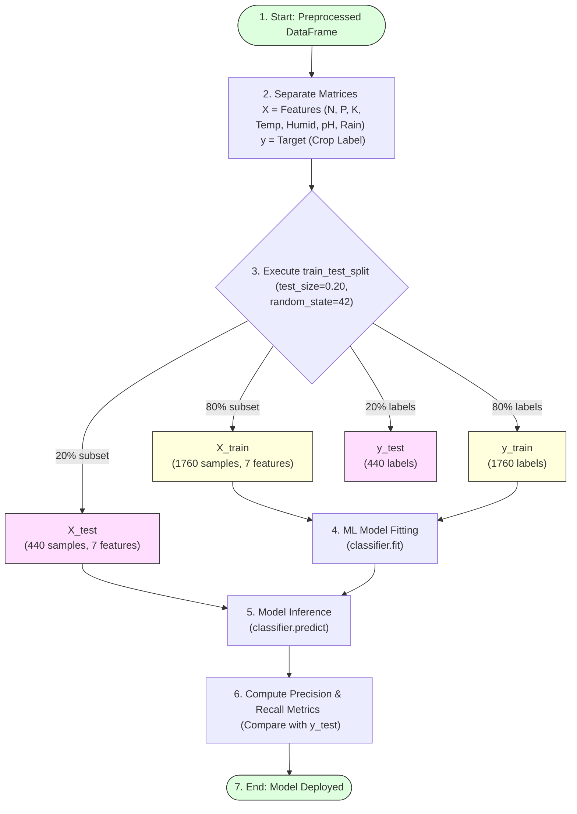

# Task 17: Splitting Data into Train and Test Sets

## Project Title

**OptiCrop: Smart Agricultural Production Optimization Engine**

---

# Objective

The objective of this task is to divide the preprocessed agricultural dataset into training and testing datasets for machine learning model development. Splitting the dataset ensures that the model is trained on one portion of the data and evaluated on another, providing an unbiased assessment of prediction performance and improving the reliability of crop recommendations.

---

# Introduction

Machine Learning models must be evaluated using unseen data to determine how well they generalize to new inputs. Instead of training the model on the entire dataset, the data is divided into two subsets:
* Training Set
* Testing Set

The training dataset is used to learn patterns from historical agricultural data, while the testing dataset is used to evaluate the model's prediction capability on unseen records.

In the OptiCrop project, the `train_test_split()` function from the Scikit-learn library is used to perform this task efficiently.

---

# Train-Test Split Partition Pipeline



---

# Feature and Target Variables

Before splitting the dataset, the independent variables (features) and dependent variable (target) are separated.

### Feature Variables (X)
The feature variables include:
* Nitrogen (N)
* Phosphorous (P)
* Potassium (K)
* Temperature
* Humidity
* pH
* Rainfall

```python
# Drop target column to isolate features matrix
X = data.drop("label", axis=1)
```

---

### Target Variable (y)
The target variable is the crop label that the model predicts.

```python
# Isolate crop target vector
y = data["label"]
```

---

# Train-Test Split Implementation

The dataset is divided using the `train_test_split()` function.

```python
from sklearn.model_selection import train_test_split

# Split dataset into 80% train and 20% test subsets
X_train, X_test, y_train, y_test = train_test_split(
    X,
    y,
    test_size=0.20,
    random_state=42
)
```

---

# Parameters Description

### 1. `test_size`
```python
test_size = 0.20
```
* **Meaning:** Allocates 20% of the dataset for testing and 80% for training.

### 2. `random_state`
```python
random_state = 42
```
* **Purpose:** Sets the random seed generator. Using a fixed value ensures that the split partition is reproducible and consistent across program runs.

---

# Dataset Distribution

For a dataset containing **2200 records**:

| Dataset Split | Percentage | Approximate Records Count |
| :--- | :--- | :--- |
| **Training Set** | 80% | 1,760 |
| **Testing Set** | 20% | 440 |

The training dataset is used to build the Logistic Regression model, while the testing dataset is reserved for evaluating its performance.

---

# Verifying Dataset Shapes

The dataset sizes can be verified using:

```python
# Verify split shapes
print("X_train shape:", X_train.shape)
print("X_test shape:", X_test.shape)
print("y_train shape:", y_train.shape)
print("y_test shape:", y_test.shape)
```

### Expected Output:
```
X_train shape: (1760, 7)
X_test shape: (440, 7)
y_train shape: (1760,)
y_test shape: (440,)
```

---

# Importance of Train-Test Splitting

Splitting the dataset helps to:
* Evaluate model performance accurately.
* Prevent overfitting (data memorization).
* Test prediction capability on unseen conditions.
* Improve model reliability.
* Validate machine learning algorithms.

---

# Advantages

* Fair model evaluation.
* Better generalization.
* Improved prediction accuracy.
* Reduced bias.
* Reliable performance measurement.

---

# Applications

Train-test splitting is essential for:
* Logistic Regression
* K-Means Clustering evaluation
* K-Nearest Neighbors
* Decision Tree
* Random Forest
* Other Machine Learning algorithms

---

# Observations

* The dataset was successfully divided into training and testing subsets.
* The training dataset contains the majority of records used for model learning.
* The testing dataset is reserved for evaluating prediction performance.
* The selected split ratio provides a balanced evaluation while retaining sufficient training data.

---

# Conclusion

The agricultural dataset was successfully divided into training and testing subsets using the `train_test_split()` function. This preprocessing step ensures that machine learning models are trained on historical data and evaluated on unseen samples, resulting in more reliable and unbiased crop recommendation performance.

---

# Outcome

The OptiCrop dataset was successfully split into feature and target variables, followed by training and testing datasets. The prepared data is now ready for machine learning model building, performance evaluation, and intelligent crop prediction.
