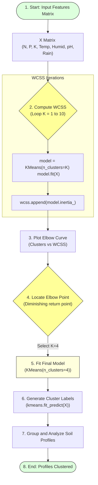

# Task 18: K-Means Clustering

## Project Title

**OptiCrop: Smart Agricultural Production Optimization Engine**

---

# Objective

The objective of this task is to apply the K-Means Clustering algorithm to group agricultural data into similar clusters based on soil nutrients and environmental conditions. Clustering helps identify hidden patterns within the dataset and supports intelligent crop recommendation by grouping records with similar agricultural characteristics.

---

# Introduction

K-Means Clustering is an unsupervised machine learning algorithm used to partition data into multiple clusters. Unlike supervised learning algorithms, K-Means does not require labeled output data. Instead, it groups observations based on feature similarity.

In the OptiCrop project, K-Means is applied to agricultural parameters such as Nitrogen (N), Phosphorous (P), Potassium (K), Temperature, Humidity, pH, and Rainfall. The resulting clusters represent similar soil and climate conditions that can be used for agricultural analysis and crop recommendation.

---

# K-Means Clustering & Elbow Method Pipeline



---

# Algorithm Specifications

* **Machine Learning Algorithm:** K-Means Clustering
* **Learning Type:** Unsupervised Learning (discovers groupings without reference to target crop labels)

---

# Features Used

The clustering process uses the following agricultural parameters:
* Nitrogen (N)
* Phosphorous (P)
* Potassium (K)
* Temperature
* Humidity
* pH
* Rainfall

These features are used to group similar agricultural conditions into clusters.

---

# Determining the Optimal Number of Clusters

The **Elbow Method** is used to identify the optimal number of clusters.

### What is the Elbow Method?
The Elbow Method plots the **Within-Cluster Sum of Squares (WCSS)** against different values of **K** (number of clusters). WCSS measures the sum of squared distances between each data point and its assigned cluster centroid. The point where the decrease in WCSS starts to level off (forming an "elbow" shape) is called the **Elbow Point**, representing the most suitable number of clusters.

---

# Calculating WCSS in Python

```python
from sklearn.cluster import KMeans

# Initialize list to hold WCSS values
wcss = []

# Calculate WCSS for cluster numbers from 1 to 10
for i in range(1, 11):
    model = KMeans(n_clusters=i, init='k-means++', random_state=42)
    model.fit(X)
    wcss.append(model.inertia_) # Inertia represents WCSS
```

---

# Plotting the Elbow Graph

```python
import matplotlib.pyplot as plt

# Generate the elbow curve plot
plt.figure(figsize=(10, 6))
plt.plot(range(1, 11), wcss, marker='o', linestyle='--', color='blue')
plt.title("Elbow Method for Optimal Cluster Count Selection")
plt.xlabel("Number of Clusters (K)")
plt.ylabel("Within-Cluster Sum of Squares (WCSS)")
plt.grid(True)
plt.show()
```

The Elbow Graph helps determine the optimal cluster count by identifying the point where additional clusters provide diminishing improvements.

---

# Training the K-Means Model

After selecting the optimal number of clusters (determined to be **K=4** based on the elbow curve inflection point), the final K-Means model is trained.

```python
# Initialize final model
kmeans = KMeans(
    n_clusters=4,
    init='k-means++',
    random_state=42
)

# Train the model using agricultural parameters
kmeans.fit(X)
```

---

# Predicting Cluster Labels

Cluster labels are generated using:

```python
# Generate cluster assignments for all records
clusters = kmeans.fit_predict(X)

# Assign cluster column back to copy of dataframe
data_clustered = data.copy()
data_clustered['cluster'] = clusters
```

Each agricultural record is assigned to one of the identified clusters.

---

# Model Workflow Steps

1. Import K-Means library.
2. Select agricultural features.
3. Calculate WCSS values.
4. Plot the Elbow Graph.
5. Select optimal cluster count.
6. Train the K-Means model.
7. Generate cluster labels.
8. Analyze agricultural patterns.

---

# Advantages

* **Discovers hidden agricultural patterns:** Identifies similar nutrient bounds.
* **Groups similar soil conditions:** Simplifies classification analysis.
* **Supports crop recommendation:** Acts as a helper feature or zoning index.
* **Improves agricultural decision-making:** Translates multi-variable parameters into clear segments.
* **Simple and computationally efficient:** Highly scalable for larger datasets.

---

# Applications

K-Means Clustering can be used for:
* Soil classification
* Crop grouping
* Climate pattern analysis
* Agricultural zoning
* Precision farming

---

# Observations

* The Elbow Method successfully identified an appropriate number of clusters.
* Similar agricultural records were grouped together.
* Cluster analysis revealed distinct soil and climate patterns.
* The clustering results support better agricultural insights and crop planning.

---

# Conclusion

The K-Means Clustering algorithm was successfully implemented to group agricultural records based on environmental conditions. The Elbow Method was used to determine the optimal number of clusters, ensuring meaningful grouping of data. These clusters provide valuable insights into agricultural patterns and contribute to more intelligent crop recommendation.

---

# Outcome

The agricultural dataset was successfully clustered using K-Means. The identified clusters represent similar soil and environmental conditions, forming a strong analytical foundation for intelligent crop recommendation and further machine learning model development.
