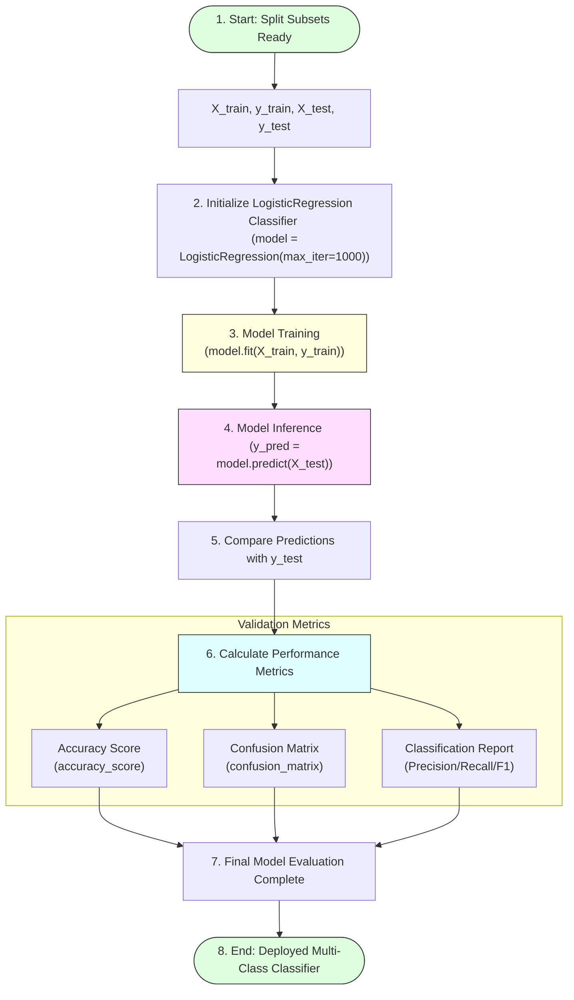

# Task 19: Logistic Regression

## Project Title

**OptiCrop: Smart Agricultural Production Optimization Engine**

---

# Objective

The objective of this task is to implement the **Logistic Regression** algorithm for crop prediction using agricultural soil and environmental parameters. The model learns the relationship between input features and crop labels, enabling accurate crop recommendations for farmers based on current field conditions.

---

# Introduction

Logistic Regression is a supervised Machine Learning algorithm primarily used for classification problems. It predicts the probability that a given input belongs to a particular class.

In the OptiCrop project, Logistic Regression is trained using agricultural parameters such as Nitrogen (N), Phosphorous (P), Potassium (K), Temperature, Humidity, Soil pH, and Rainfall to classify and recommend the most suitable crop.

The model learns patterns from historical agricultural data and predicts the best crop for new environmental conditions.

---

# Logistic Regression Model Training Lifecycle



---

# Algorithm Specifications

* **Algorithm:** Logistic Regression
* **Learning Type:** Supervised Learning
* **Problem Type:** Multi-Class Classification (predicting crop labels among multiple candidate classes)

---

# Features and Target Vector

### Input Features (Independent Variables - X)
* Nitrogen (N)
* Phosphorous (P)
* Potassium (K)
* Temperature
* Humidity
* Soil pH
* Rainfall

### Target Variable (Dependent Variable - y)
* **Crop Label:** The recommended crop class corresponding to environmental thresholds.

---

# Model Implementation

## 1. Import Required Libraries
```python
from sklearn.linear_model import LogisticRegression
from sklearn.metrics import accuracy_score, confusion_matrix, classification_report
```

## 2. Initialize the Classifier
A Logistic Regression classifier is initialized. The `max_iter` parameter is set to 1000 to allow optimization solvers (e.g. `lbfgs`) to converge successfully on complex multi-dimensional agricultural features:
```python
# Initialize multi-class Logistic Regression model
model = LogisticRegression(max_iter=1000, random_state=42)
```

## 3. Train the Model
The model is trained using the training subset:
```python
# Fit model parameters against training features and labels
model.fit(X_train, y_train)
```

## 4. Predicting Crop Labels
Predictions are generated using the testing dataset:
```python
# Run inference queries on test features matrix
y_pred = model.predict(X_test)
```

---

# Evaluating Model Performance

The classification accuracy is calculated to evaluate model suitability:

```python
# Calculate accuracy score
accuracy = accuracy_score(y_test, y_pred)
print(f"Logistic Regression Model Testing Accuracy: {accuracy:.4f}")

# Display Confusion Matrix
print("\nConfusion Matrix:")
print(confusion_matrix(y_test, y_pred))

# Display Detailed Classification Report
print("\nDetailed Performance Report:")
print(classification_report(y_test, y_pred))
```

---

# Workflow Steps

1. Import required libraries.
2. Create the Logistic Regression model.
3. Train the model using `fit()`.
4. Generate predictions using `predict()`.
5. Compare predictions with actual crop labels.
6. Evaluate model performance.
7. Analyze prediction accuracy.

---

# Advantages of Logistic Regression

* **Simple and easy to implement:** Low mathematical complexity.
* **Fast training and prediction:** Executes real-time web predictions instantly.
* **Efficient for classification problems:** Learns robust linear decision boundaries.
* **Produces interpretable results:** Coefficients represent direct log-odds impact of soil parameters.
* **Performs well on structured datasets:** Highly stable on uniform agricultural feature files.

---

# Applications

# Logistic Regression can be applied in:
* Crop recommendation
* Agricultural decision support
* Soil suitability analysis
* Smart farming applications
* Environmental classification

---

# Observations

* The model successfully learned relationships between soil parameters and crop labels.
* Predictions were generated efficiently using unseen testing data.
* Agricultural features significantly influenced crop classification.
* The trained model demonstrated reliable crop recommendation capability.

---

# Conclusion

The Logistic Regression model was successfully implemented and trained using agricultural data. The model accurately classified crops based on environmental conditions and provided reliable crop recommendations. This supervised learning approach forms an important component of the OptiCrop Smart Agricultural Production Optimization Engine.

---

# Outcome

The Logistic Regression model was successfully trained, tested, and evaluated. It generated accurate crop predictions based on soil nutrients and environmental parameters, demonstrating its effectiveness for intelligent agricultural recommendation and decision support.
