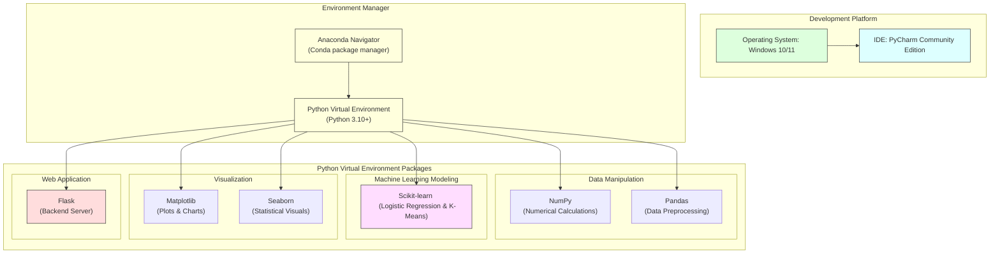

# Task 2: Pre-requisites

## Project Title

**OptiCrop: Smart Agricultural Production Optimization Engine**

---

# Objective

The objective of this task is to install and configure all the software tools, Python libraries, and development environments required for building the **OptiCrop: Smart Agricultural Production Optimization Engine**. These prerequisites provide the foundation for data preprocessing, machine learning model development, visualization, and web application deployment.

---

# Overview

The OptiCrop project relies on several open-source tools and Python libraries to perform data analysis, build machine learning models, visualize insights, and deploy the application. Proper installation of these technologies ensures a smooth and efficient development workflow.

---

# Environment & Technology Stack Diagram



---

# Software Requirements

## 1. Anaconda Navigator

**Purpose**

Anaconda Navigator provides a graphical interface for managing Python environments and installing data science packages without using command-line tools.

**Features**

- Environment management
- Package installation
- Jupyter Notebook support
- Spyder IDE integration
- Conda package management

**Official Website**

https://www.anaconda.com/download

---

## 2. PyCharm

**Purpose**

PyCharm is the primary Integrated Development Environment (IDE) used to develop the Flask application and machine learning code.

**Features**

- Intelligent code completion
- Python debugging
- Virtual environment support
- Git integration
- Flask project development

**Official Website**

https://www.jetbrains.com/pycharm/

---

# Python Libraries

## NumPy

**Purpose**

NumPy is used for numerical computations and efficient handling of multidimensional arrays.

**Applications**

- Mathematical operations
- Array manipulation
- Statistical calculations

**Installation**

```bash
pip install numpy
```

**Documentation**

https://numpy.org/doc/stable/

---

## Pandas

**Purpose**

Pandas is used for reading, cleaning, transforming, and analyzing datasets.

**Applications**

- Load CSV files
- Handle missing values
- Data preprocessing
- Feature engineering

**Installation**

```bash
pip install pandas
```

**Documentation**

https://pandas.pydata.org/docs/

---

## Scikit-learn

**Purpose**

Scikit-learn provides machine learning algorithms used in the OptiCrop project.

**Algorithms Used**

- Logistic Regression
- K-Means Clustering
- Model Evaluation
- Train-Test Split

**Installation**

```bash
pip install scikit-learn
```

**Documentation**

https://scikit-learn.org/stable/

---

## Matplotlib

**Purpose**

Matplotlib is used for creating graphs and charts during Exploratory Data Analysis.

**Applications**

- Line charts
- Bar charts
- Histograms
- Scatter plots

**Installation**

```bash
pip install matplotlib
```

**Documentation**

https://matplotlib.org/stable/

---

## Seaborn

**Purpose**

Seaborn enhances data visualization by providing statistical plots with attractive themes.

**Applications**

- Heatmaps
- Pair plots
- Box plots
- Distribution plots

**Installation**

```bash
pip install seaborn
```

**Documentation**

https://seaborn.pydata.org/

---

## Flask

**Purpose**

Flask is used to build the web application for crop prediction.

**Applications**

- Backend development
- Route management
- User input handling
- Model deployment
- Prediction generation

**Installation**

```bash
pip install flask
```

**Documentation**

https://flask.palletsprojects.com/

---

# Development Environment Checklist

* **Operating System:** Windows 10 / Windows 11
* **Programming Language:** Python 3.10 or above
* **IDE:** PyCharm Community Edition
* **Package Manager:** Conda / pip

---

# Project Workflow

1. Install Anaconda Navigator
2. Install Python
3. Install PyCharm
4. Create a virtual environment
5. Install required Python libraries
6. Import project dataset
7. Develop and train machine learning models
8. Build Flask application
9. Deploy the crop recommendation system

---

# Outcome

All required software tools, Python libraries, and development environments were successfully installed and configured. The system is now ready for data preprocessing, machine learning model development, visualization, and application deployment.
