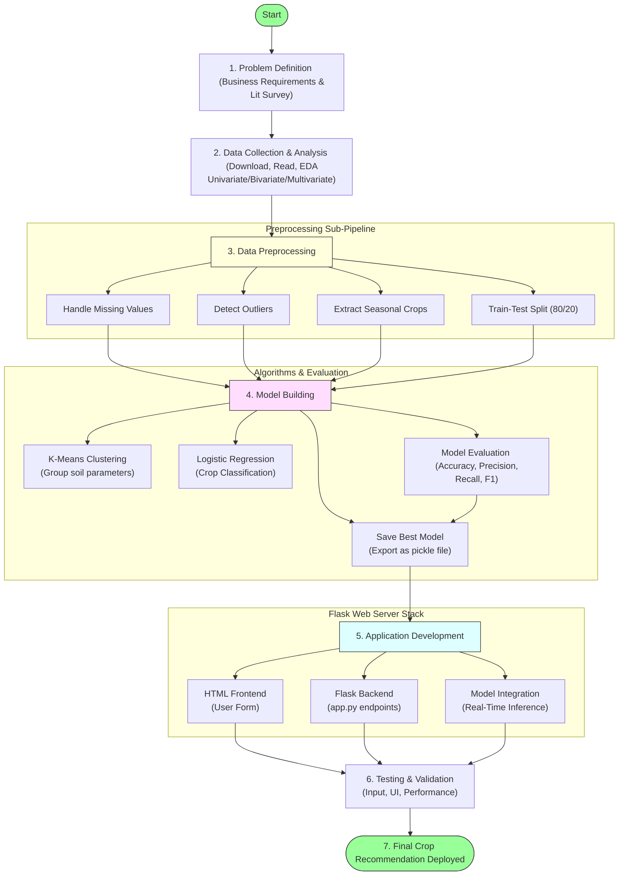

# Task 3: Project Workflow

## Project Title

**OptiCrop: Smart Agricultural Production Optimization Engine**

---

# Objective

The objective of this task is to define the complete workflow of the **OptiCrop: Smart Agricultural Production Optimization Engine**. The workflow provides a structured roadmap covering problem definition, data collection, preprocessing, machine learning model development, application building, and deployment.

---

# Overview

The OptiCrop project follows a systematic Machine Learning lifecycle to develop an intelligent crop recommendation system. The workflow ensures every phase of the project is completed in an organized manner, resulting in accurate crop predictions and an interactive web application.

---

# Project Workflow Pipeline Diagram

---

# Epic 1: Define Problem and Understanding

## Story 1: Define the Agricultural Problem
Identify the challenges faced by farmers in selecting the most suitable crop based on soil nutrients and environmental conditions.
* **Output:**
  * Problem Statement
  * Project Scope

## Story 2: Business Requirements
Gather functional and technical requirements for the crop recommendation system.
* **Activities:**
  * Identify stakeholders
  * Define project objectives
  * Determine expected outputs

## Story 3: Literature Survey
Study existing agricultural recommendation systems and Machine Learning algorithms used in crop prediction.
* **Areas Covered:**
  * Precision Agriculture
  * Machine Learning in Agriculture
  * Crop Recommendation Systems
  * Soil Analysis

## Story 4: Social and Business Impact
Analyze the benefits of implementing AI-driven crop recommendation.
* **Benefits:**
  * Higher crop yield
  * Better resource utilization
  * Sustainable farming
  * Reduced farming risks
  * Data-driven decision making

---

# Epic 2: Data Collection and Analysis

## Story 1: Download Dataset
Collect the agricultural dataset from reliable sources (e.g. Kaggle agricultural datasets).

## Story 2: Import Libraries
Import Python libraries required for analysis and model development:
* NumPy & Pandas
* Matplotlib & Seaborn
* Scikit-learn
* Flask

## Story 3: Read Dataset
Load the dataset and examine its structure.
* **Activities:**
  * Display dataset
  * Check dimensions
  * View column names
  * Understand data types

## Story 4: Univariate Analysis
Analyze each feature independently using:
* Histograms
* Count plots
* Distribution plots

## Story 5: Bivariate Analysis
Study relationships between two variables using:
* Temperature vs Crop
* Rainfall vs Crop
* pH vs Crop

## Story 6: Multivariate Analysis
Analyze interactions among multiple agricultural parameters using:
* Correlation Matrix
* Pair Plot
* Heatmap

---

# Epic 3: Data Preprocessing

## Story 1: Handle Missing Values
Identify and remove or replace null values using statistical measures (imputations).

## Story 2: Handle Outliers
Detect abnormal values using statistical methods (Z-score, IQR) and visualization (box plots).

## Story 3: Extract Seasonal Crops
Categorize crops based on growing seasons and prepare relevant features.

## Story 4: Train-Test Split
Split the dataset into training and testing sets (typically 80:20 ratio) for model evaluation.

---

# Epic 4: Model Building

## Story 1: K-Means Clustering
Cluster agricultural conditions based on similarities to discover underlying soil profiles.

## Story 2: Logistic Regression
Train a Logistic Regression multi-class classifier for crop classification.

## Story 3: Model Evaluation
Evaluate models using suitable performance metrics:
* Accuracy & Precision
* Recall & F1 Score
* Confusion Matrix

## Story 4: Save Best Model
Serialize and save the trained model using Pickle for web application deployment.

---

# Epic 5: Application Building

## Story 1: HTML Frontend
Develop responsive web pages for user interaction:
* **Features:**
  * Input Form
  * Prediction Result
  * User-friendly Interface

## Story 2: Flask Backend
Develop backend APIs to process user input, scale variables, and generate predictions.

## Story 3: Testing and Validation
Validate application functionality and prediction accuracy.
* **Testing Includes:**
  * Input Validation
  * Model Prediction
  * User Interface Testing
  * Performance Testing

---

# Expected Outcome

The workflow establishes a clear development roadmap for the OptiCrop project, ensuring systematic implementation from data collection to deployment of an intelligent crop recommendation application.
